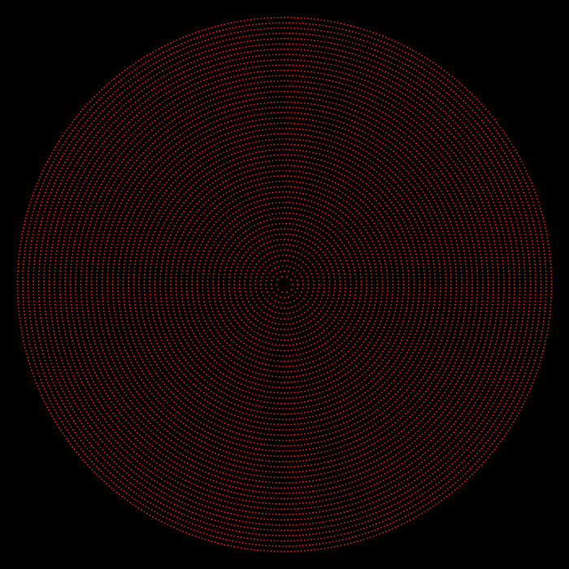
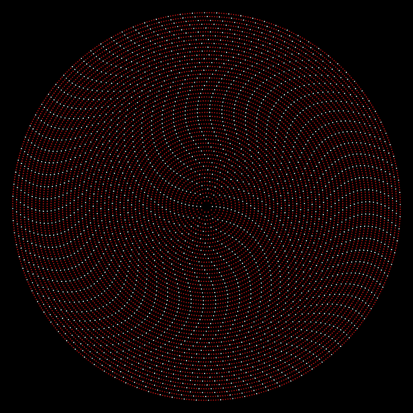
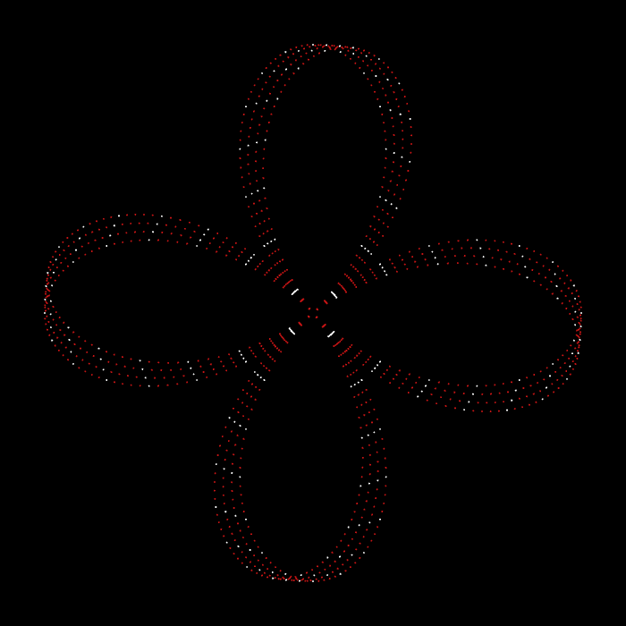
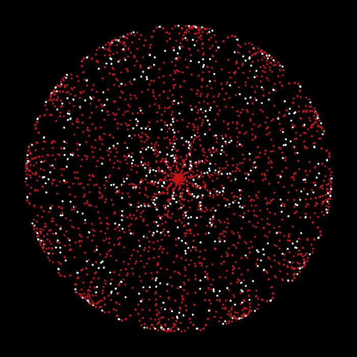

# ReWhitney

## MIT Media Lab - Recreating the Past - Class 2: John Whitney

The MIT Media Lab class - Recreating the Past - explores a number of influential artists who have, over the past century, added their own unique perspective on computational art. Each week focuses on a new artist and through exploring their view point and recreating their artworks I hope to gain a valuable window into their thought processes, helping me learn how to express my own opinions through computational art. 

## John Whitney

The second week focuses on John Whitney and animation, here is a except on John from William Moritz (https://www.awn.com/mag/issue2.5/2.5pages/2.5moritzwhitney.html):

"With his computerized motion-control set-up, Whitney could produce a variety of innovative designs and metamorphoses of text and still images, which proved very successful in advertising and titling of commercial projects. By 1960 Whitney prepared a sample reel of these and other effects he could produce, and solicited work for his Motion Graphics, Inc. company. This company kept him so busy he did not have time to make personal films using the computerized motion-control set-up. His sample reel was artfully edited and ended with a lovely final image of a lissajous curve multiplied dozens of times, to appear twisting in waves, suggesting the time-lapse of a blossoming flower."

## Permutations

Permutations is a short film created by Whitney in 1969 which focuses almost entirely on circular patterns and the combination of harmonic patterns. I chose to focus specifically on a rotating grid a points which can at times feel totally random until all of sudden a sense of order emerges from the chaos. I recreated this using OpenFrameworks and an animation approach based on sine wave harmonics. The final version of the code includes a gui so that parameters can be tweaked and experimented with to find new and interesting harmonic patterns.

Here is a gif of the recreation (showing the use of the GUI):

And here is a link to the original video: (0:52 - 1:30)
https://youtu.be/50CV6_tDJ9M?t=52 

#### Process
I started with a simple circular shape - creating a function to draw a circle of dots with a given resolution and radius. I then added white points at each 5th occurence to add texture and allow me to view the effects of the animations more clearly. These circular patterns, when rotated at varying speeds and frequencies created some very interesting optical illusions. It was however definitely not a faithful representation of the original.

In the original Permutations video, the circular shapes are akin to flower - they are a series of petals that rotate and align at various times. This reminded me of the Rose function where the circle's radius is also a function of cosine. Implementing this gave me the desired roses and then through tweaking the frequencies, harmonics and rose function parameters I created the final artwork shown above.
 

 

